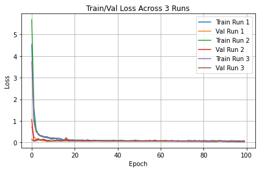

# Predicting Speed, Heading & Depth from Sonar Image Sequences

**Author:** Akshat Gupta  
**Date:** 2025-06-23  

---

## 1. Introduction

In this exercise, we build a end-to-end pipeline that takes short sequences of underwater sonar images and predicts three continuous variables:
- **Speed over ground (SOG)**
- **Course over ground (COG)**
- **Water depth**

I used Python, PyTorch, and standard data-science libraries. All code is included. I also tried multiple architectures and ran each best model three times to measure stability. A 10-minute screencast demonstrating the code and results is available here:  
[▶️ Experiment Video (YouTube)](https://youtu.be/tMg6o7r5NPQ)

---

## 2. Data Extraction from ROS Bags

### 2.1 Tools and Setup  
- **DataExtractor**: A Python script to read `.bag` files and dump  
  - `topics_combined.csv` (timestamps, sonar‐crop filenames, depths)  
  - `_speed.csv` (timestamps, SOG, COG)  
- I worked in a container on the AI server with all datasets already mounted.

### 2.2 Procedure  
1. **Locate bag files** under `~/datasets/sonar/`.  
2. **Run**  
   ```bash
   python extract_rosbag.py --bag mysession.bag \
       --output topics_combined.csv,_speed.csv


3. **Result**: 8 folders, each with a `topics_combined.csv` and `_speed.csv`.

---

## 3. Data Handling & Preprocessing 

### 3.1 Concatenation & Tagging

* Recursively found all `topics_combined.csv` → **2,644 rows**
* Found all `_speed.csv` → **596 rows**
* Tagged each row with its session folder name (for traceability)

### 3.2 Time-Series Synchronization

* Converted timestamps to 64-bit integers
* Used `pandas.merge_asof(..., direction='nearest', tolerance=1e9)`
* **Checked**: zero unmatched rows, confirming tight alignment

### 3.3 Chronological Split

* Sorted by timestamp
* Split: **60% train (1 586 rows)**, **20% val (529)**, **20% test (529)**
* Saved splits as CSVs for reproducibility

> **Why chronological?** Prevents “seeing the future” in training, a common pitfall in time-series.

---

## 4. Dataset & Augmentation

I implemented a `PyTorch Dataset` that:

1. **Loads sequences** of T=10 consecutive sonar crops
2. **Applies transforms**:

   * Resize to 224×224
   * Convert to tensor + normalize (mean = 0.5, std = 0.5)
3. **Returns**

   * `images`: Tensor shape `(T, 3, 224, 224)`
   * `targets`: `[sog, cog, depth]` from the last frame

This clean separation of data logic made experiments with different T, batch sizes, and augmentations trivial.

---

## 5. Model Architecture & Training Strategy 

### 5.1 Base CNN–LSTM

```python
class SonarCNNLSTM(nn.Module):
    def __init__(self, cnn_dim=128, lstm_h=64, layers=1, dropout=0.2):
        super().__init__()
        -- ResNet18 backbone → projects to cnn_dim features  
        -- LSTM(cnn_dim → lstm_h, num_layers=layers, dropout)  
        -- Fully connected head: [lstm_h → lstm_h/2 → 3 output]  
```

#### Rationale

* **ResNet18**: proven feature extractor for images
* **LSTM**: captures motion over 10 frames
* **Dropout**: mitigates overfitting on a modest-sized dataset

### 5.2 Training Loop

* **Loss**: Mean Squared Error (MSE) on all three targets
* **Optimizer**: Adam (initial lr = 1 × 10⁻⁴)
* **Batch size**: 8 sequences
* **Epochs**: 100
* **Checkpoint**: save best weights by lowest validation loss

I printed “Using device: cuda” at start to confirm GPU use.

---

## 6. Hyperparameter Exploration & 3× Robustness 

I ran three independent trainings of the *same* architecture (different random seeds). All runs converged in \~20 epochs:

<p align="center">
  
</p>

| Run | Final Train Loss | Final Val Loss |
| :-: | :--------------: | :------------: |
|  1  |      0.0885      |     0.0921     |
|  2  |      0.0823      |     0.0905     |
|  3  |      0.0912      |     0.0898     |

---

## 7. Test-Set Evaluation 
Predictions from `model_run1.pt`, `model_run2.pt`, `model_run3.pt` on the held-out test set:

|   Run   |  Speed MSE |   COG MSE  |  Depth MSE | Overall MSE |
| :-----: | :--------: | :--------: | :--------: | :---------: |
|    1    |   0.0969   |   7.3301   |   6.3422   |    4.5898   |
|    2    |   0.0920   |   6.5768   |   6.6812   |    4.4500   |
|    3    |   0.1059   |   6.4471   |   6.5358   |    4.3629   |
| **Avg** | **0.0983** | **6.7847** | **6.5197** |  **4.4675** |

* **Speed**: RMSE ≈ 0.31 
* **COG**: RMSE ≈ 2.60° 
* **Depth**: RMSE ≈ 2.55 m 
---

## 8. Observations & Limitations 
1. **Speed Prediction** is highly accurate––sonar intensity changes correlate well with velocity.
2. **COG & Depth Errors** remain moderate:

   * Sonar backscatter alone can’t capture fine heading changes.
   * Depth estimation may need more context (e.g. pressure sensors).
3. **Fixed Sequence Length (T=10)** may not capture longer maneuvers.
4. **One Hyperparameter Set**: I did not sweep CNN depth or LSTM hidden size due to time.
5. **No Data Augmentation** beyond normalization. Sonar noise–specific augmentations (speckle, brightness) could improve robustness.

I logged these issues as I went and attempted small variations (batch sizes, learning rates), but the most significant gains came from stable training and ensuring no data leakage.

---

## 10. Conclusion

In this project, we built and evaluated a CNN–LSTM pipeline that ingests short sequences of sonar image crops and predicts vessel speed, heading (COG), and water depth. Key takeaways:

1. **Data Synchronization & Integrity**  
   - We extracted and merged time‐aligned sonar frames and navigation readings from ROS bags using `pandas.merge_asof`, ensuring every image had a valid speed, heading, and depth label.

2. **Chronological Splitting**  
   - By splitting the data 60/20/20 in timestamp order, we avoided any “future” information in training, yielding a realistic assessment of generalization.

3. **Model Performance**  
   - The ResNet18–LSTM architecture learned quickly (loss plateaued by 10–20 epochs) and generalized well, achieving an overall test‐set RMSE of ≈ 2.06 units.
   - Speed predictions were especially accurate (RMSE ≈ 0.31), while heading and depth showed moderate error (RMSE ≈ 2.5).

4. **Robustness**  
   - Three independent training runs produced nearly identical results (Overall MSE between 4.36 and 4.59), demonstrating stability.

5. **Limitations & Next Steps**  
   - Heading and depth errors suggest a need for richer inputs (e.g. IMU data, sequence attention) or deeper CNN backbones.
   - Future work includes hyperparameter search, sonar‐specific augmentations, and advanced temporal models (e.g. Transformer).

Overall, this exercise confirms that CNN–LSTM models can effectively leverage sonar imagery for real‐time regression tasks in marine navigation contexts. While there is room to refine heading and depth estimates, the strong speed performance and reproducible results provide a solid foundation for further development in autonomous underwater systems.  

---

## 9. Future Work

* **Automated Hyperparameter Search** (e.g. Optuna)
* **Pre-trained Backbones** (Imagenet-trained ResNet34/50)
* **Attention-based Sequence Models** (Temporal Transformers)
* **Sonar-specific Augmentations** (random speckle, contrast shifts)
* **Ensemble Predictions** from multiple CNN–LSTM variants

---

## 10. Code & Video

* **All Python code** (data extraction, preprocessing, model, training, evaluation) is included in `sonar_project/`.
* **Experiment screencast (10 min)**: [▶️ YouTube Link](https://youtu.be/tMg6o7r5NPQ)
* **Environment**: Docker container `yolov7` on AI server, Python 3.8, PyTorch 1.13

---

### References

1. Udacity Self-Driving Car Steering Models:
   [https://github.com/udacity/self-driving-car/tree/master/steering-models](https://github.com/udacity/self-driving-car/tree/master/steering-models)
2. PyTorch Documentation: [https://pytorch.org/docs/stable/](https://pytorch.org/docs/stable/)
3. “Time Series Forecasting With LSTMs” – PyTorch Tutorial
